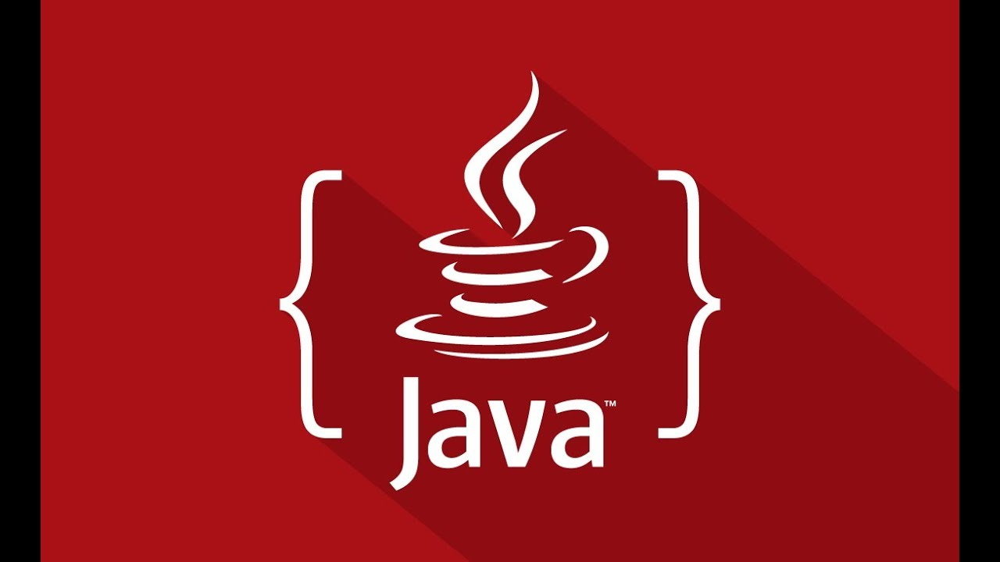

# flights-time

## Task description

Напишите программу на языке программирования java, 
которая прочитает файл tickets.json и рассчитает:

- Среднее время полета между городами Владивосток и Тель-Авив.
- 90-й процентиль времени полета между городами Владивосток и Тель-Авивю

Программа должна вызываться из командной строки Linux,
результаты должны быть представлены в текстовом виде.